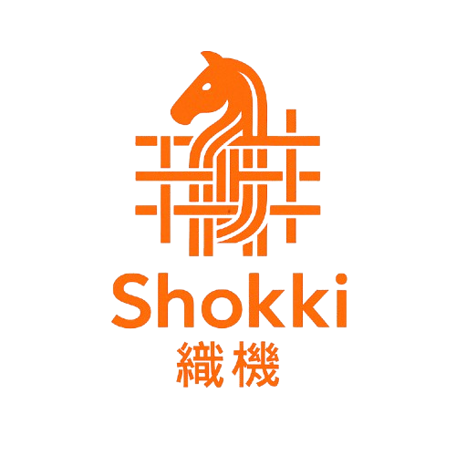

# The Shokki Project

  

<h4 align="center"><em>Weaving the future of networking and infrastructure.</em></h4>

Shokki is an open-source project focused on building foundational digital systems that combine **secure communication**, **modular design**, and **strategic thinking**.

The name _Shokki_ (織機), meaning “loom” in Japanese, reflects our intent: to craft intricate, high-quality systems with elegance and care. Inspired by _Shogi_ (将棋), the Japanese strategy game, we value clarity, precision, and long-term vision in the systems we create.

## Goals

- Build cryptographically secure communication protocols.
- Design modular, composable infrastructure primitives.
- Explore efficient, decentralized networking systems.
- Foster an open and collaborative engineering culture.

## Get Involved

We’re just getting started. If this resonates with you, feel free to watch this space, open an issue, or reach out.
